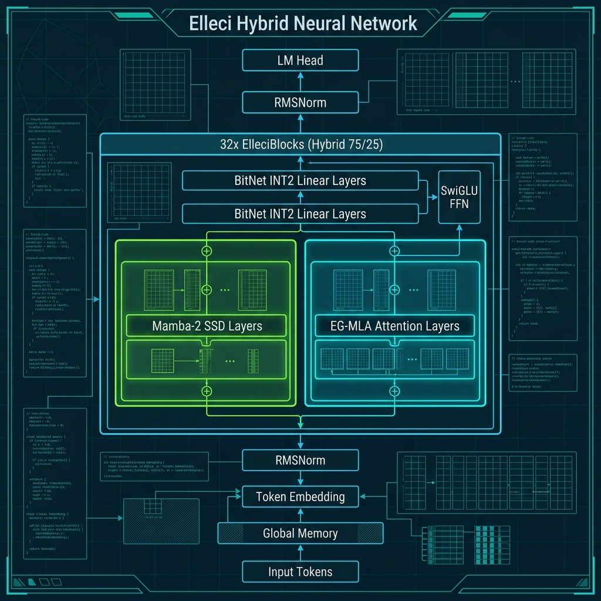

# Elleci Training

Hybrid LLM Architecture: Mamba-2 SSD + EG-MLA + BitNet INT2.



This repository contains the training framework and architectural definition for Elleci, an experimental hybrid language model leveraging ternary quantization.

## Current Status
* **Architecture:** Implemented and integrated.
* **Quantization Kernel:** INT2 Tensor Core CUDA kernels implemented and tested via unit tests.
* **Training Pipeline:** Configured for 3-phase curriculum.
* **Validation:** Currently in "advanced proof-of-concept" stage. Full-scale convergence and benchmarks on the 7B configuration have not yet been documented. 

## Reproducibility / What has actually been tested
* **Unit Tests:** Operations like `MuonOptimizer`, `HESTIA`, `ProRes`, and custom CUDA Tensor Core operations pass the automated test suite.
* **Dry-runs:** The training script successfully initializes the model, compiles the Triton/CUDA kernels, loads the streaming dataset, and performs forward/backward steps without OOM on single-GPU setups matching the configs.
* **Full Training:** **Not yet verified**. We do not have loss curves, evaluation scores, or checkpoint validation for a complete pre-training run at the 7B scale.

## Quick Start (vast.ai / A100)

```bash
# 1. Clone
git clone https://github.com/step325/Elleci-Training-Vast.git && cd elleci-train

# 2. Setup (installs deps, compiles CUDA kernels)
chmod +x setup.sh && ./setup.sh

# 3. Quick test (dry-run)
python3 train.py --config configs/a100_7b.yaml --dry-run

# 4. Train
nohup python3 -u train.py --config configs/a100_7b.yaml > log/training_7b.log 2>&1 &
```

## Configurations

The following configurations represent the current defaults in the yaml files:

| Config | GPU | d_model | layers | params | batch | max_seq_len |
|--------|-----|---------|--------|--------|-------|---------|
| `configs/a100_7b.yaml` | A100 40GB | 4096 | 32 | ~7.3B | 4 | 1024 |
| `configs/rtx4070_s.yaml` | RTX 4070 12GB | 1536 | 20 | ~0.72B| 2 | 512 |

## Feature Readiness

* **Implemented and Active:**
  * Mamba-2 (Matmul-based SSD)
  * Multi-Head Latent Attention (MLA / EG-MLA)
  * BitNet INT2 Quantization (with Hestia annealing)
  * Liger Fused Linear Cross-Entropy

* **Disabled in Current Config:**
  * Mixture of Experts (MoE) - Disabled due to dimensional incompatibilities with INT2 hysteresis.
  * Thinking Loop / PonderNet - Code present but bypassed by default router settings.

## Known Limitations
* **Single-GPU Only:** The architecture and INT2 optimizations do not currently support distributed training (DDP / DeepSpeed / ZeRO).
* **CUDA Dependency:** Custom kernels require NVIDIA hardware with appropriate compute capability (sm_70/sm_80+).
* **OOM with larger batches:** Batch size 8 on the 7B configuration triggers Out-Of-Memory errors on 40GB A100s. Current default is 4.

## VRAM Budget Estimate (A100 7B, Checkpointing ON, batch=4)

| Component | GB |
|-----------|-----|
| INT2 weights (7.0B x 0.25B/param) | ~1.75 |
| Hysteresis counters (7.0B x 0.5B/param) | ~3.50 |
| FP32 params (embedding/norms) | ~1.20 |
| Activations (checkpoints, intermediate) | ~8.40 |
| Optimizer (AdamW for FP32 only) | ~3.60 |
| Temporary (gradients, workspace) | ~2.00 |
| **Total Estimated** | **~20.5 / 40** |

## Licensing and Third-Party Components
* The repository code does not currently have an explicit open-source license.
* **Datasets:** The training pipeline utilizes multiple HuggingFace datasets. Note that the active dataset mix includes `facebook/natural_reasoning` which is distributed under a **CC-BY-NC-4.0** (Non-Commercial) license.
* **Patents:** The BitNet architecture is subject to Microsoft patents. Legal review is advised before commercial application.
